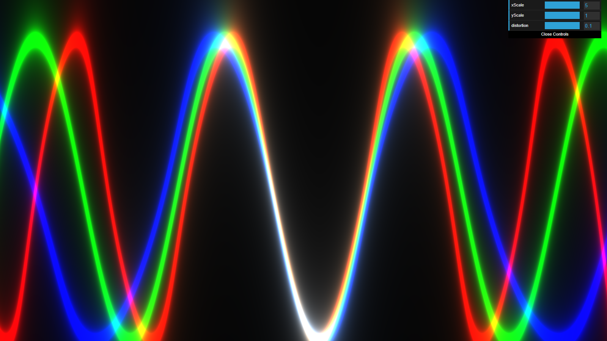
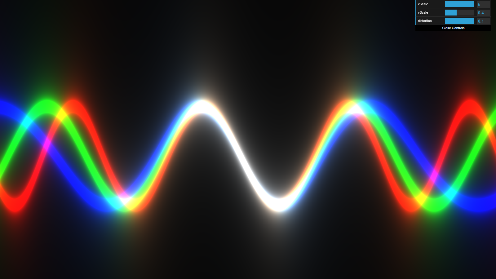

# Webgl_rgb_wave
practice of webgl(three js and glsl)

Run locally by using this commands

```bash
# Install dependencies (only the first time)
npm install

# Run the local server at localhost:1234
npm run dev

```

 <br>
 <br>
 <br>
